# Задачи по Эконометрике-1: Метод наименьших квадратов
Н. В. Артамонов, А. Н. Лата (МГИМО МИД России)

- [Теория](#теория)
  - [Задача (прямая с константой)](#задача-прямая-с-константой)
  - [Задача (прямая без константы)](#задача-прямая-без-константы)
  - [Задача (обратная регрессия без
    константы)](#задача-обратная-регрессия-без-константы)
  - [Задача (обратная регрессия с
    константой)](#задача-обратная-регрессия-с-константой)
  - [Задача (квадратичный многочлен)](#задача-квадратичный-многочлен)
- [Практика (Python)](#практика-python)
  - [sleep equation \#1](#sleep-equation-1)
  - [sleep equation \#2](#sleep-equation-2)
  - [sleep equation \#3](#sleep-equation-3)
  - [sleep equation \#4](#sleep-equation-4)
  - [sleep equation \#5](#sleep-equation-5)
  - [output equation \#1](#output-equation-1)
  - [output equation \#2](#output-equation-2)
  - [output equation \#3](#output-equation-3)
  - [output equation \#4](#output-equation-4)

# Теория

## Задача (прямая с константой)

Пусть задано $n$ наблюдений (точек на плоскости)
$\lbrace x_i,y_i\rbrace_{i=1}^n$. Линейная функция $y=\beta_0+\beta_1x$
«подгоняется» под наблюдения методом наименьших квадратов (OLS):

- выведите систему уравнений для нахождения параметров оптимальной
  (подогнанной) прямой, наименее уклоняющейся от заданных наблюдений;
- выведите формулы для оценок $\widehat{\beta}_0$ и $\widehat{\beta}_1$
  коэффициентов оптимальной прямой;
- покажите, что для оценок коэффициентов верно:

$$
\begin{aligned}
  \widehat{\beta}_1&=\frac{\mathrm{s.cov}(x,y)}{\mathrm{s.Var}(x)}, &
  \widehat{\beta}_0&=\bar{y}-\widehat{\beta}_1\cdot \bar{x}.
\end{aligned}
$$

Здесь $\mathrm{s.cov}(x,y)$ — выборочная ковариация, $\mathrm{s.Var}(x)$
— выборочная дисперсия.

## Задача (прямая без константы)

Пусть задано $n$ наблюдений (точек на плоскости)
$\lbrace x_i,y_i\rbrace_{i=1}^n$. Линейная функция $y=\beta x$
подгоняется под наблюдения методом наименьших квадратов (OLS):

- выведите уравнение для нахождения параметра оптимальной прямой,
  наименее уклоняющейся от заданных наблюдений (точек на плоскости);
- выведите формулу для оценки $\widehat{\beta}$ коэффициента оптимальной
  прямой.

## Задача (обратная регрессия без константы)

Пусть $\widehat{\beta}$ есть OLS-оценка коэффициента наклона линейной
функции $y$ на $x$ без константы, а $\widehat{\gamma}$ — OLS-оценка
коэффициента наклона линейной функции $x$ на $y$ без константы. Верно ли
для этих оценок равенство

$$
\widehat{\gamma}=\frac{1}{\widehat{\beta}}?
$$

Ответ поясните.

## Задача (обратная регрессия с константой)

Пусть $\widehat{\beta}_1$ есть OLS-оценка коэффициента наклона линейной
функции $y$ на $x$ с константой, а $\widehat{\gamma}_1$ — OLS-оценка
коэффициента наклона линейной функции $x$ на $y$ с константой. Верно ли
равенство

$$
\widehat{\gamma}_1=\frac{1}{\widehat{\beta}_1}?
$$

Ответ поясните.

## Задача (квадратичный многочлен)

Пусть задано $n$ наблюдений (точек на плоскости)
$\lbrace x_i,y_i\rbrace_{i=1}^n$. Парабола
$y=\beta_0+\beta_1x+\beta_2x^2$ подгоняется под наблюдения методом
наименьших квадратов (OLS). Выведите систему уравнений для нахождения
параметров оптимальной параболы.

# Практика (Python)

> [!IMPORTANT]
>
> ### Важно
>
> - Во всех задачах логарифм натуральный; константа включается по
>   умолчанию.
> - Данные — в папке `datasets/`, описание наборов данных — в файле
>   [`datasets/data-description.md`](../datasets/data-description.md).
> - Численные ответы округлите до 2-х десятичных знаков; оценки, которые
>   при этом обращаются в ноль, — до трёх значащих цифр.
> - В ответах коэффициенты подписаны так, как их выводит statsmodels:
>   `Intercept` — константа, `np.log(x)` — $\log x$, `I(x ** 2)` —
>   $x^2$.

## sleep equation \#1

Для набора данных `sleep75` (`sleep`, `totwrk` — минуты в неделю, `age`
— годы) рассмотрим регрессию **sleep на totwrk**.

Постройте диаграмму рассеяния **sleep vs totwrk** с подогнанной прямой.

Ответ: <a href="#fig-sleep-totwrk" class="quarto-xref">Рисунок 1</a>; на
нём показаны обе прямые — с константой и без константы.

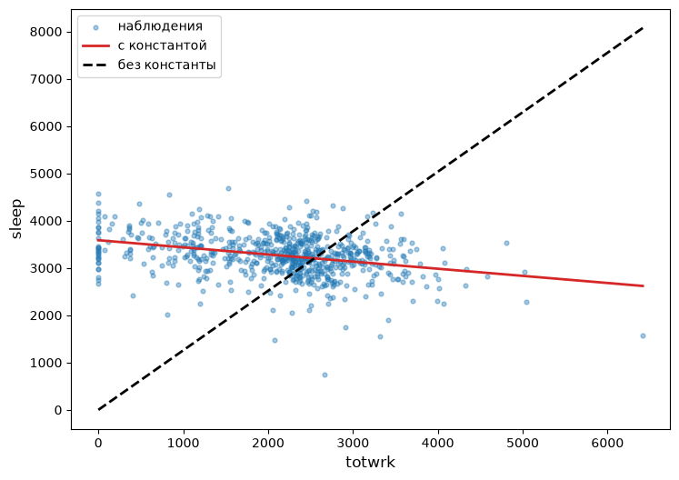

Рисунок 1: sleep и totwrk: подогнанные прямые с константой и без
константы

**С константой**

Найдите параметры оптимальной прямой **sleep на totwrk**. **Ответ
округлите до 2-х десятичных знаков.**

Ответ:

| Переменная |  Оценка |
|:-----------|--------:|
| Intercept  | 3586.38 |
| totwrk     |   -0.15 |

Модель была подогнана по 706 наблюдениям.

**Без константы**

Найдите параметры оптимальной прямой **sleep на totwrk** без константы.
**Ответ округлите до 2-х десятичных знаков.**

Ответ:

| Переменная | Оценка |
|:-----------|-------:|
| totwrk     |   1.26 |

Модель была подогнана по 706 наблюдениям.

## sleep equation \#2

Для набора данных `sleep75` рассмотрим регрессию **sleep на age**.

Постройте диаграмму рассеяния **sleep vs age** с подогнанной прямой.

Ответ: <a href="#fig-sleep-age" class="quarto-xref">Рисунок 2</a>; на
нём показаны обе прямые — с константой и без константы.

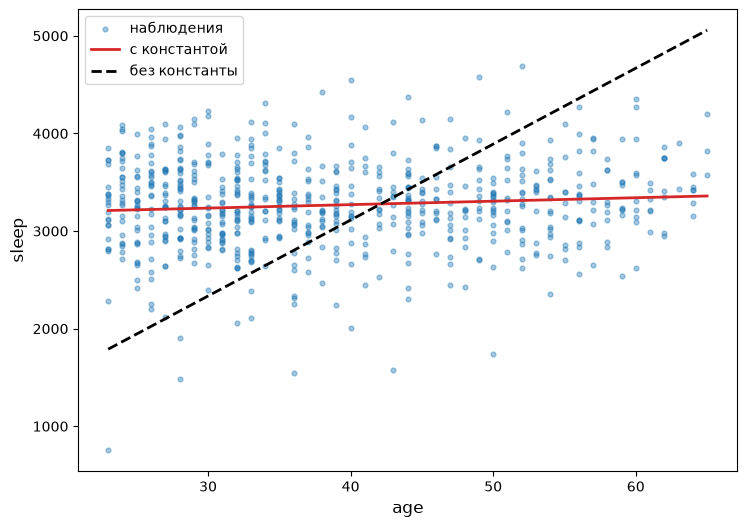

Рисунок 2: sleep и age: подогнанные прямые с константой и без константы

**С константой**

Найдите параметры оптимальной прямой **sleep на age**. **Ответ округлите
до 2-х десятичных знаков.**

Ответ:

| Переменная |  Оценка |
|:-----------|--------:|
| Intercept  | 3128.91 |
| age        |    3.54 |

Модель была подогнана по 706 наблюдениям.

**Без константы**

Найдите параметры оптимальной прямой **sleep на age** без константы.
**Ответ округлите до 2-х десятичных знаков.**

Ответ:

| Переменная | Оценка |
|:-----------|-------:|
| age        |  77.82 |

Модель была подогнана по 706 наблюдениям.

## sleep equation \#3

Для набора данных `sleep75` рассмотрим регрессию **sleep на totwrk,
I(totwrk\*\*2)**.

Постройте диаграмму рассеяния **sleep vs totwrk** с подогнанной
параболой.

Ответ: <a href="#fig-sleep-totwrk-sq" class="quarto-xref">Рисунок 3</a>.

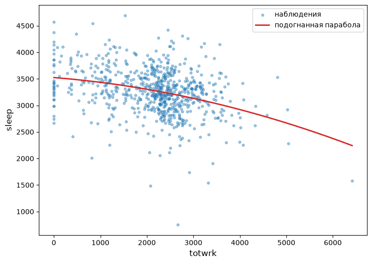

Рисунок 3: sleep и totwrk: подогнанная парабола

Найдите параметры оптимальной параболы **sleep на totwrk,
I(totwrk\*\*2)**. **Ответ округлите до 2-х десятичных знаков.**

Ответ:

| Переменная       |    Оценка |
|:-----------------|----------:|
| Intercept        |   3523.59 |
| totwrk           |     -0.07 |
| I(totwrk \*\* 2) | -2.03e-05 |

Модель была подогнана по 706 наблюдениям.

## sleep equation \#4

Для набора данных `sleep75` рассмотрим регрессию **sleep на age,
I(age\*\*2)**.

Постройте диаграмму рассеяния **sleep vs age** с подогнанной параболой.

Ответ: <a href="#fig-sleep-age-sq" class="quarto-xref">Рисунок 4</a>.

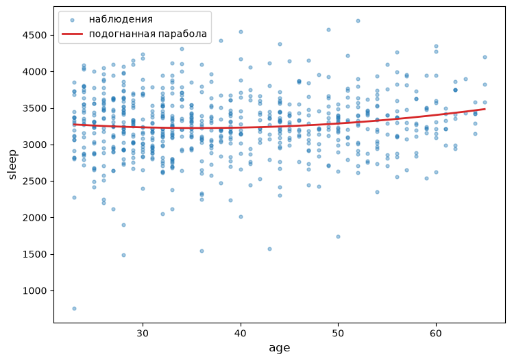

Рисунок 4: sleep и age: подогнанная парабола

Найдите параметры оптимальной параболы **sleep на age, I(age\*\*2)**.
**Ответ округлите до 2-х десятичных знаков.**

Ответ:

| Переменная    |  Оценка |
|:--------------|--------:|
| Intercept     | 3608.03 |
| age           |  -21.49 |
| I(age \*\* 2) |    0.30 |

Модель была подогнана по 706 наблюдениям.

## sleep equation \#5

Для набора данных `sleep75` рассмотрим регрессию **sleep на totwrk,
age**.

Найдите параметры оптимальной плоскости **sleep на totwrk, age**.
**Ответ округлите до 2-х десятичных знаков.**

Ответ:

| Переменная |  Оценка |
|:-----------|--------:|
| Intercept  | 3469.20 |
| totwrk     |   -0.15 |
| age        |    2.92 |

Модель была подогнана по 706 наблюдениям.

## output equation \#1

Для набора данных `Labour` (`output`, `capital` — млн евро, `labour` —
число работников) рассмотрим регрессии **output на capital** и
**np.log(output) на np.log(capital)**.

**Гистограммы**

Постройте гистограммы переменных **output, np.log(output), capital,
np.log(capital), labour, np.log(labour)**.

Ответ: <a href="#fig-labour-hist" class="quarto-xref">Рисунок 5</a>.

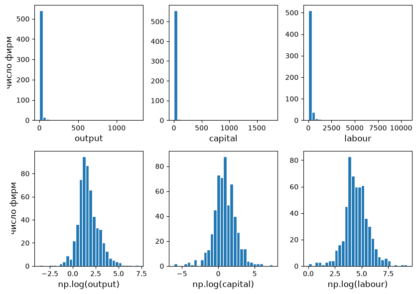

Рисунок 5: Гистограммы output, capital, labour и их логарифмов (Labour)

**Диаграмма рассеяния**

Постройте диаграмму рассеяния **output vs capital** с подогнанной
прямой.

Ответ: <a href="#fig-output-capital" class="quarto-xref">Рисунок 6</a>;
на нём показаны обе прямые — с константой и без константы.

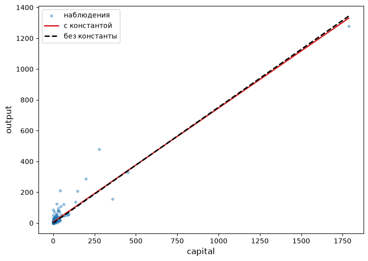

Рисунок 6: output и capital: подогнанные прямые с константой и без
константы

**С константой**

Найдите параметры оптимальной прямой **output на capital**. **Ответ
округлите до 2-х десятичных знаков.**

Ответ:

| Переменная | Оценка |
|:-----------|-------:|
| Intercept  |   6.19 |
| capital    |   0.74 |

Модель была подогнана по 569 наблюдениям.

**Без константы**

Найдите параметры оптимальной прямой **output на capital** без
константы. **Ответ округлите до 2-х десятичных знаков.**

Ответ:

| Переменная | Оценка |
|:-----------|-------:|
| capital    |   0.75 |

Модель была подогнана по 569 наблюдениям.

**Диаграмма рассеяния в логарифмах**

Постройте диаграмму рассеяния **np.log(output) vs np.log(capital)** с
подогнанной прямой.

Ответ:
<a href="#fig-output-capital-log" class="quarto-xref">Рисунок 7</a>; на
нём показаны обе прямые — с константой и без константы.

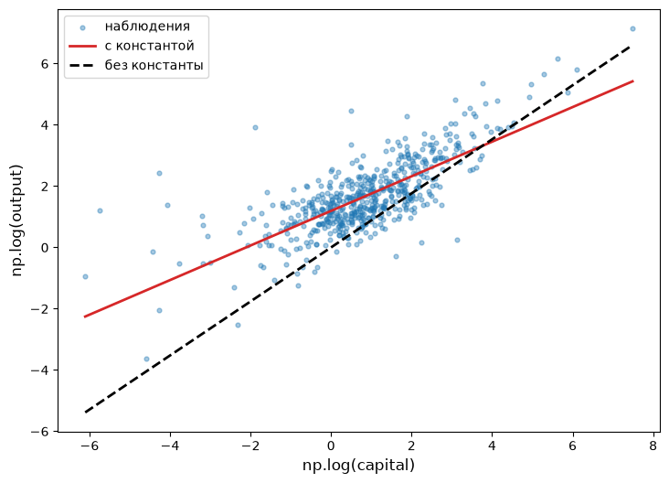

Рисунок 7: np.log(output) и np.log(capital): подогнанные прямые с
константой и без константы

**В логарифмах, с константой**

Найдите параметры оптимальной прямой **np.log(output) на
np.log(capital)**. **Ответ округлите до 2-х десятичных знаков.**

Ответ:

| Переменная      | Оценка |
|:----------------|-------:|
| Intercept       |   1.19 |
| np.log(capital) |   0.56 |

Модель была подогнана по 569 наблюдениям.

**В логарифмах, без константы**

Найдите параметры оптимальной прямой **np.log(output) на
np.log(capital)** без константы. **Ответ округлите до 2-х десятичных
знаков.**

Ответ:

| Переменная      | Оценка |
|:----------------|-------:|
| np.log(capital) |   0.88 |

Модель была подогнана по 569 наблюдениям.

## output equation \#2

Для набора данных `Labour` рассмотрим регрессии **output на labour** и
**np.log(output) на np.log(labour)**.

**Диаграмма рассеяния**

Постройте диаграмму рассеяния **output vs labour** с подогнанной прямой.

Ответ: <a href="#fig-output-labour" class="quarto-xref">Рисунок 8</a>;
на нём показаны обе прямые — с константой и без константы.

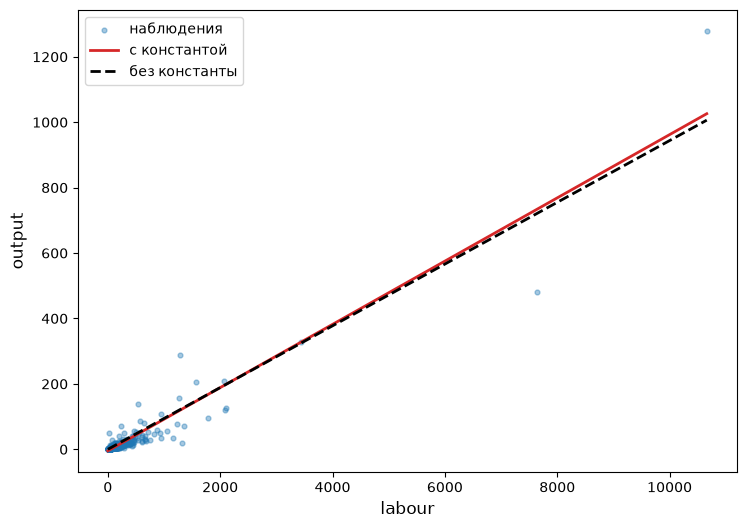

Рисунок 8: output и labour: подогнанные прямые с константой и без
константы

**С константой**

Найдите параметры оптимальной прямой **output на labour**. **Ответ
округлите до 2-х десятичных знаков.**

Ответ:

| Переменная | Оценка |
|:-----------|-------:|
| Intercept  |  -4.72 |
| labour     |   0.10 |

Модель была подогнана по 569 наблюдениям.

**Без константы**

Найдите параметры оптимальной прямой **output на labour** без константы.
**Ответ округлите до 2-х десятичных знаков.**

Ответ:

| Переменная | Оценка |
|:-----------|-------:|
| labour     |   0.09 |

Модель была подогнана по 569 наблюдениям.

**Диаграмма рассеяния в логарифмах**

Постройте диаграмму рассеяния **np.log(output) vs np.log(labour)** с
подогнанной прямой.

Ответ:
<a href="#fig-output-labour-log" class="quarto-xref">Рисунок 9</a>; на
нём показаны обе прямые — с константой и без константы.

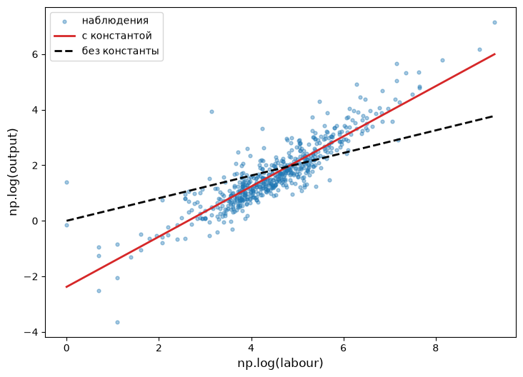

Рисунок 9: np.log(output) и np.log(labour): подогнанные прямые с
константой и без константы

**В логарифмах, с константой**

Найдите параметры оптимальной прямой **np.log(output) на
np.log(labour)**. **Ответ округлите до 2-х десятичных знаков.**

Ответ:

| Переменная     | Оценка |
|:---------------|-------:|
| Intercept      |  -2.38 |
| np.log(labour) |   0.90 |

Модель была подогнана по 569 наблюдениям.

**В логарифмах, без константы**

Найдите параметры оптимальной прямой **np.log(output) на
np.log(labour)** без константы. **Ответ округлите до 2-х десятичных
знаков.**

Ответ:

| Переменная     | Оценка |
|:---------------|-------:|
| np.log(labour) |   0.41 |

Модель была подогнана по 569 наблюдениям.

## output equation \#3

Для набора данных `Labour` рассмотрим регрессию **np.log(output) на
np.log(capital), I(np.log(capital)\*\*2)**.

Постройте диаграмму рассеяния **np.log(output) vs np.log(capital)** с
подогнанной параболой.

Ответ:
<a href="#fig-output-capital-sq" class="quarto-xref">Рисунок 10</a>.

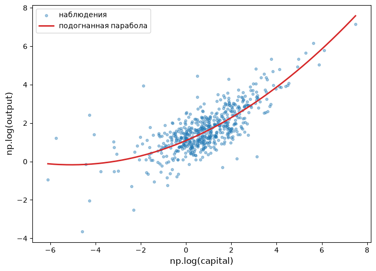

Рисунок 10: np.log(output) и np.log(capital): подогнанная парабола

Найдите параметры оптимальной параболы **np.log(output) на
np.log(capital), I(np.log(capital)\*\*2)**. **Ответ округлите до 2-х
десятичных знаков.**

Ответ:

| Переменная                | Оценка |
|:--------------------------|-------:|
| Intercept                 |   1.09 |
| np.log(capital)           |   0.50 |
| I(np.log(capital) \*\* 2) |   0.05 |

Модель была подогнана по 569 наблюдениям.

## output equation \#4

Для набора данных `Labour` рассмотрим регрессию **np.log(output) на
np.log(labour), I(np.log(labour)\*\*2)**.

Постройте диаграмму рассеяния **np.log(output) vs np.log(labour)** с
подогнанной параболой.

Ответ:
<a href="#fig-output-labour-sq" class="quarto-xref">Рисунок 11</a>.

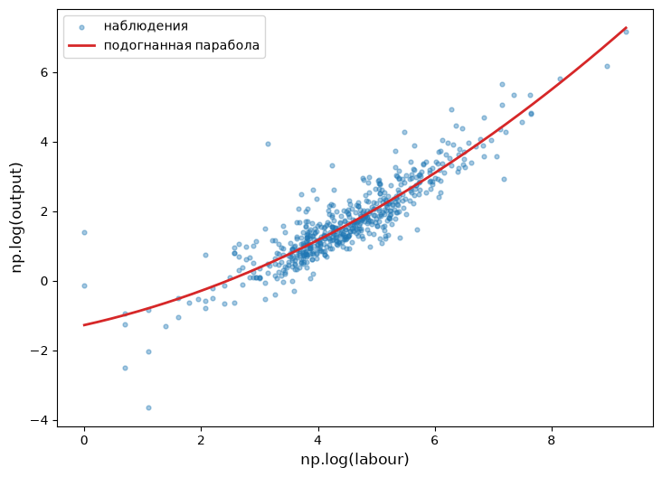

Рисунок 11: np.log(output) и np.log(labour): подогнанная парабола

Найдите параметры оптимальной параболы **np.log(output) на
np.log(labour), I(np.log(labour)\*\*2)**. **Ответ округлите до 2-х
десятичных знаков.**

Ответ:

| Переменная               | Оценка |
|:-------------------------|-------:|
| Intercept                |  -1.28 |
| np.log(labour)           |   0.37 |
| I(np.log(labour) \*\* 2) |   0.06 |

Модель была подогнана по 569 наблюдениям.
